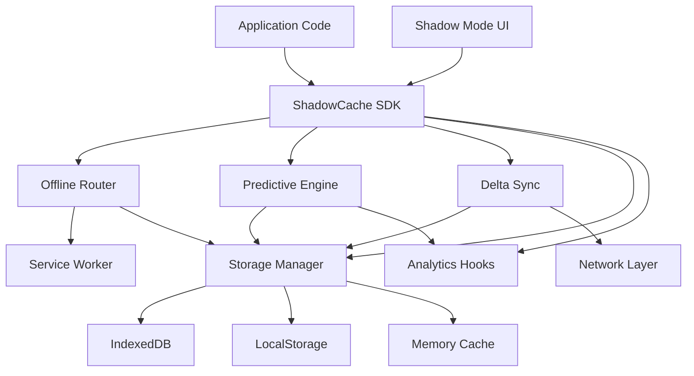

# Design Document

## Overview

ShadowCache is a modern, TypeScript-based offline-first caching system that combines predictive intelligence with robust synchronization capabilities. The architecture follows a modular design with clear separation between the core caching engine, predictive analytics, synchronization logic, storage abstraction, and UI components.

The system is built around several key principles:
- **Modularity**: Each subsystem (predictive engine, router, sync, storage) operates independently with well-defined interfaces
- **Progressive Enhancement**: The system gracefully degrades based on browser capabilities
- **Zero Configuration**: Sensible defaults allow immediate use while supporting deep customization
- **Type Safety**: Full TypeScript implementation with comprehensive type definitions
- **Performance First**: Minimal runtime overhead with lazy loading and tree-shaking support

## Architecture

### High-Level Architecture




### Module Structure

The system is organized into the following modules:

1. **Core SDK** (`@shadowcache/sdk`): Main entry point and orchestration layer
2. **Predictive Engine** (`@shadowcache/predictor`): Behavior analysis and pre-fetching
3. **Offline Router** (`@shadowcache/router`): Request interception and cache serving
4. **Delta Sync** (`@shadowcache/sync`): Efficient data synchronization
5. **Storage Manager** (`@shadowcache/storage`): Storage abstraction with fallback chain
6. **Shadow UI** (`@shadowcache/ui`): React/Web Components for offline indicators
7. **Analytics** (`@shadowcache/analytics`): Event tracking and MCP integration

### Service Worker Architecture

The Offline Router operates within a Service Worker context, intercepting fetch events and applying caching strategies. The Service Worker communicates with the main thread via MessageChannel for configuration updates and status reporting.

## Components and Interfaces

### SDK Core Interface

```typescript
interface ShadowCacheConfig {
  cacheRules: CacheRule[];
  predictive?: PredictiveConfig;
  sync?: SyncConfig;
  storage?: StorageConfig;
  analytics?: AnalyticsConfig;
  ui?: UIConfig;
}

interface CacheRule {
  id: string;
  pattern: string | RegExp;
  strategy: 'network-first' | 'cache-first' | 'stale-while-revalidate' | 'cache-only';
  priority: 1 | 2 | 3 | 4 | 5 | 6 | 7 | 8 | 9 | 10;
  maxAge?: number;
  maxEntries?: number;
  networkTimeout?: number;
}

class ShadowCache {
  static async init(config: ShadowCacheConfig): Promise<ShadowCache>;
  async getStatus(): Promise<CacheStatus>;
  async clearCache(pattern?: string): Promise<void>;
  async prefetch(urls: string[]): Promise<void>;
  async sync(): Promise<SyncResult>;
  on(event: string, handler: Function): void;
  off(event: string, handler: Function): void;
}
```


### Predictive Engine Interface

```typescript
interface PredictiveConfig {
  enabled: boolean;
  learningRate: number;
  minConfidence: number;
  maxPrefetchSize: number;
  idleThreshold: number;
}

interface NavigationPattern {
  sequence: string[];
  frequency: number;
  lastAccessed: number;
}

class PredictiveEngine {
  recordNavigation(url: string): void;
  analyzePatterns(): Promise<string[]>;
  getPredictions(currentUrl: string): Promise<PredictedResource[]>;
  startPrefetching(): void;
  stopPrefetching(): void;
}

interface PredictedResource {
  url: string;
  confidence: number;
  priority: number;
}
```

### Offline Router Interface

```typescript
interface RouterConfig {
  scope: string;
  fallbackPage?: string;
  offlineAssets: string[];
}

class OfflineRouter {
  async register(config: RouterConfig): Promise<void>;
  async unregister(): Promise<void>;
  applyStrategy(request: Request, rule: CacheRule): Promise<Response>;
  isOnline(): boolean;
  onStateChange(handler: (online: boolean) => void): void;
}
```


### Delta Sync Interface

```typescript
interface SyncConfig {
  endpoint: string;
  batchSize: number;
  retryAttempts: number;
  conflictResolution: 'server-wins' | 'client-wins' | 'manual';
}

interface DeltaPatch {
  id: string;
  timestamp: number;
  operations: Operation[];
}

interface Operation {
  op: 'add' | 'remove' | 'replace';
  path: string;
  value?: any;
}

class DeltaSync {
  recordChange(objectId: string, before: any, after: any): void;
  async sync(): Promise<SyncResult>;
  async resolveConflict(conflict: Conflict): Promise<void>;
  getPendingChanges(): DeltaPatch[];
}

interface SyncResult {
  success: boolean;
  synced: number;
  conflicts: number;
  bytesTransferred: number;
  duration: number;
}
```

### Storage Manager Interface

```typescript
interface StorageConfig {
  maxSize: number;
  evictionPolicy: 'lru' | 'lfu' | 'priority';
  encryption?: boolean;
}

type StorageLevel = 'indexeddb' | 'localstorage' | 'memory';

class StorageManager {
  async set(key: string, value: any, metadata?: Metadata): Promise<StorageLevel>;
  async get(key: string): Promise<{ value: any; level: StorageLevel } | null>;
  async delete(key: string): Promise<void>;
  async clear(): Promise<void>;
  async getUsage(): Promise<StorageUsage>;
  async evict(bytesNeeded: number): Promise<void>;
}

interface StorageUsage {
  total: number;
  used: number;
  available: number;
  byLevel: Record<StorageLevel, number>;
}
```


### Analytics Interface

```typescript
interface AnalyticsConfig {
  providers: AnalyticsProvider[];
  sampleRate: number;
}

interface AnalyticsProvider {
  name: string;
  track(event: AnalyticsEvent): void | Promise<void>;
}

interface AnalyticsEvent {
  type: 'cache-hit' | 'cache-miss' | 'sync-complete' | 'offline' | 'online';
  timestamp: number;
  data: Record<string, any>;
}

class AnalyticsHooks {
  registerProvider(provider: AnalyticsProvider): void;
  unregisterProvider(name: string): void;
  track(event: AnalyticsEvent): void;
}
```

### Shadow Mode UI Interface

```typescript
interface UIConfig {
  theme: 'dark' | 'light' | 'auto';
  position: 'top' | 'bottom' | 'corner';
  showDetails: boolean;
}

interface ShadowUIProps {
  isOnline: boolean;
  cacheStatus: CacheStatus;
  syncStatus: SyncStatus;
  onSync?: () => void;
}

// React Component
function ShadowIndicator(props: ShadowUIProps): JSX.Element;

// Web Component
class ShadowIndicatorElement extends HTMLElement {
  set isOnline(value: boolean);
  set cacheStatus(value: CacheStatus);
  set syncStatus(value: SyncStatus);
}
```

## Data Models

### Cache Entry Model

```typescript
interface CacheEntry {
  key: string;
  url: string;
  response: SerializedResponse;
  metadata: CacheMetadata;
}

interface CacheMetadata {
  cachedAt: number;
  expiresAt?: number;
  priority: number;
  size: number;
  accessCount: number;
  lastAccessed: number;
  ruleId: string;
  etag?: string;
  version?: string;
}

interface SerializedResponse {
  status: number;
  statusText: string;
  headers: Record<string, string>;
  body: ArrayBuffer | string;
  type: ResponseType;
}
```


### Prediction Model

```typescript
interface PredictionModel {
  patterns: Map<string, NavigationPattern>;
  transitions: Map<string, Map<string, number>>;
  resourceGraph: Map<string, Set<string>>;
}

interface NavigationPattern {
  sequence: string[];
  frequency: number;
  lastAccessed: number;
  confidence: number;
}
```

### Sync State Model

```typescript
interface SyncState {
  pendingPatches: DeltaPatch[];
  conflicts: Conflict[];
  lastSyncTime: number;
  syncInProgress: boolean;
}

interface Conflict {
  objectId: string;
  clientVersion: any;
  serverVersion: any;
  timestamp: number;
}
```

Now I need to complete the prework analysis before writing the Correctness Properties section.


## Correctness Properties

*A property is a characteristic or behavior that should hold true across all valid executions of a system—essentially, a formal statement about what the system should do. Properties serve as the bridge between human-readable specifications and machine-verifiable correctness guarantees.*

### Property 1: Successful initialization establishes complete system state
*For any* valid configuration, when the SDK initializes successfully, it should register service workers, establish the storage fallback chain, and emit a ready event with system status.
**Validates: Requirements 1.2, 1.5**

### Property 2: Invalid configurations are rejected with detailed errors
*For any* invalid configuration (missing required fields, invalid types, out-of-range values), initialization should fail and return an error object containing specific validation failures.
**Validates: Requirements 1.3**

### Property 3: Cache rules are validated before activation
*For any* cache rule in the configuration, the system should validate it against the schema (checking pattern format, strategy enum, priority range) before allowing it to be used.
**Validates: Requirements 1.4, 2.1**

### Property 4: URL pattern matching works correctly
*For any* cache rule with a URL pattern (glob or regex) and any URL, the matching function should correctly determine if the URL matches the pattern according to standard glob/regex semantics.
**Validates: Requirements 2.2**

### Property 5: Priority assignment is within valid range
*For any* cache rule, the assigned priority should be an integer between 1 and 10 inclusive.
**Validates: Requirements 2.4**

### Property 6: Highest priority rule wins on conflicts
*For any* resource URL and any set of matching cache rules, the system should apply the rule with the highest priority value.
**Validates: Requirements 2.5**


### Property 7: Navigation patterns are recorded correctly
*For any* sequence of navigation events, the predictive engine should record each navigation with accurate timestamps and maintain the sequence order.
**Validates: Requirements 3.1**

### Property 8: Predictions are based on recorded patterns
*For any* current URL with recorded navigation history, the predictive engine should return predictions that correspond to frequently accessed resources following that URL in the recorded patterns.
**Validates: Requirements 3.2**

### Property 9: Prefetching respects priority ordering
*For any* set of predicted resources with different priorities, the prefetching system should fetch higher priority resources before lower priority ones.
**Validates: Requirements 3.4**

### Property 10: Eviction removes lowest priority items first
*For any* cache state at 80% capacity, when adding a new resource, the system should evict the cached resource with the lowest priority value.
**Validates: Requirements 3.5**

### Property 11: Offline mode serves cached resources
*For any* cached resource, when the router is in offline mode and receives a request for that resource, it should return the cached response.
**Validates: Requirements 4.2**

### Property 12: Uncached resources return offline errors
*For any* uncached resource URL, when the router is in offline mode and receives a request for that URL, it should return an error response indicating the resource is unavailable offline.
**Validates: Requirements 4.3**

### Property 13: Online transition triggers sync
*For any* offline-to-online state transition with pending changes, the system should automatically trigger synchronization.
**Validates: Requirements 4.5**

### Property 14: Offline UI applies shadow theme
*For any* UI component in offline mode, the rendered output should include shadow theme styling classes or attributes.
**Validates: Requirements 5.2**

### Property 15: Uncached content shows unavailable message
*For any* request for uncached content while offline, the UI should display a message indicating the content is unavailable.
**Validates: Requirements 5.3**

### Property 16: Cached content displays age metadata
*For any* cached content displayed in the UI, the rendered output should include the content's age and staleness indicators.
**Validates: Requirements 5.4**


### Property 17: Delta recording captures only changes
*For any* object modification, the delta sync should record only the changed fields/paths, not the entire object.
**Validates: Requirements 6.1, 6.2**

### Property 18: Patch application produces correct results
*For any* valid delta patch and base object, applying the patch should produce the expected modified object.
**Validates: Requirements 6.3**

### Property 19: Conflicts invoke resolution strategy
*For any* synchronization conflict (client and server versions differ), the system should invoke the configured conflict resolution strategy.
**Validates: Requirements 6.4**

### Property 20: Successful sync emits complete event
*For any* successful synchronization operation, the system should emit a sync-complete event containing statistics (synced count, bytes transferred, duration).
**Validates: Requirements 6.5**

### Property 21: Storage fallback chain operates correctly
*For any* storage operation, the system should attempt IndexedDB first, then LocalStorage if IndexedDB fails, then memory storage if LocalStorage fails, and return the successful storage level or a detailed error if all fail.
**Validates: Requirements 7.1, 7.2, 7.3, 7.4, 7.5**

### Property 22: Analytics providers receive correct events
*For any* registered analytics provider and any analytics event, the provider's track method should be called with the event data.
**Validates: Requirements 8.1, 8.3, 8.4, 8.5**

### Property 23: Async SDK methods return Promises
*For any* asynchronous SDK method, calling it should return a Promise.
**Validates: Requirements 9.2**

### Property 24: SDK errors have proper structure
*For any* SDK method error, the thrown error should be a typed error object with an error code and descriptive message.
**Validates: Requirements 9.3**

### Property 25: Cache status includes required fields
*For any* cache status query, the returned object should include storage usage, cached resource count, and sync status fields.
**Validates: Requirements 9.5**

### Property 26: HTML parsing extracts linked resources
*For any* HTML content, the parser should extract all linked resources (scripts, stylesheets, images) from standard HTML tags.
**Validates: Requirements 13.1**

### Property 27: Response headers are preserved
*For any* cached API response, retrieving it from cache should return the same headers that were stored.
**Validates: Requirements 13.2**

### Property 28: Binary data round-trips correctly
*For any* binary resource, storing it in cache and retrieving it should return identical binary data.
**Validates: Requirements 13.3**


### Property 29: Cache-control headers are respected
*For any* resource with cache-control headers, the caching system should honor the expiration and revalidation directives specified in those headers.
**Validates: Requirements 13.4**

### Property 30: Version changes invalidate cache
*For any* cached resource with a version identifier, when a new version is detected, the old cached entry should be invalidated.
**Validates: Requirements 13.5**

### Property 31: Sensitive data is encrypted
*For any* cache rule marked as sensitive, the stored content should be encrypted using Web Crypto API.
**Validates: Requirements 14.1**

### Property 32: Authentication tokens expire automatically
*For any* stored authentication token with an expiration time, attempting to retrieve it after expiration should return null or an expired indicator.
**Validates: Requirements 14.2**

### Property 33: HTTPS resources maintain security context
*For any* HTTPS resource, caching and serving it should preserve the secure context and not create mixed content warnings.
**Validates: Requirements 14.3**

### Property 34: Credential caching is rejected
*For any* cache rule attempting to cache credentials (Authorization headers, cookies with auth tokens), the system should reject the rule and emit a security warning.
**Validates: Requirements 14.4**

## Error Handling

The system implements comprehensive error handling across all modules:

### Error Types

```typescript
class ShadowCacheError extends Error {
  code: string;
  details?: Record<string, any>;
}

// Specific error types
class ConfigurationError extends ShadowCacheError {}
class StorageError extends ShadowCacheError {}
class NetworkError extends ShadowCacheError {}
class SyncError extends ShadowCacheError {}
class SecurityError extends ShadowCacheError {}
```

### Error Codes

- `INIT_FAILED`: SDK initialization failure
- `INVALID_CONFIG`: Configuration validation failure
- `STORAGE_FULL`: Storage quota exceeded
- `STORAGE_UNAVAILABLE`: All storage mechanisms failed
- `NETWORK_OFFLINE`: Operation requires network but offline
- `SYNC_CONFLICT`: Synchronization conflict detected
- `SECURITY_VIOLATION`: Security policy violation
- `RESOURCE_NOT_FOUND`: Requested resource not in cache


### Error Recovery Strategies

1. **Storage Failures**: Automatic fallback through storage chain
2. **Network Failures**: Serve from cache with staleness indicators
3. **Sync Conflicts**: Invoke configured resolution strategy
4. **Quota Exceeded**: Automatic eviction based on priority
5. **Service Worker Registration Failure**: Graceful degradation to fetch-based caching

## Testing Strategy

### Unit Testing

The system uses **Vitest** as the testing framework for its speed, TypeScript support, and modern API.

Unit tests cover:
- Configuration validation logic
- URL pattern matching algorithms
- Priority resolution for overlapping rules
- Delta patch generation and application
- Storage fallback chain logic
- Event emission and handler registration
- Error object structure and codes
- Specific edge cases:
  - Empty configurations
  - Malformed URLs
  - Storage quota edge cases
  - Conflict resolution edge cases

### Property-Based Testing

The system uses **fast-check** for property-based testing in TypeScript.

**Configuration**:
- Each property test runs a minimum of 100 iterations
- Tests use custom generators for domain-specific types (URLs, cache rules, deltas)
- Shrinking is enabled to find minimal failing cases

**Tagging Convention**:
Each property-based test includes a comment tag in this exact format:
```typescript
// Feature: shadow-cache, Property {number}: {property text}
```

**Property Test Coverage**:
- Each correctness property from this design document is implemented as a single property-based test
- Tests are placed close to implementation to catch errors early
- Generators create realistic test data within valid domains

**Key Property Tests**:
1. Configuration validation (Properties 1-3)
2. Cache rule matching and priority (Properties 4-6)
3. Prediction and eviction (Properties 7-10)
4. Offline routing (Properties 11-13)
5. Delta sync operations (Properties 17-20)
6. Storage fallback (Property 21)
7. Data integrity (Properties 26-28)
8. Security properties (Properties 31-34)


### Integration Testing

Integration tests verify:
- Service Worker registration and message passing
- End-to-end caching flows (request → cache → serve)
- Offline/online transitions with real network simulation
- UI component integration with SDK state
- Analytics provider integration via MCP

### Test Utilities

```typescript
// Test helpers for generating valid test data
class TestDataGenerator {
  static randomConfig(): ShadowCacheConfig;
  static randomCacheRule(): CacheRule;
  static randomURL(): string;
  static randomDelta(): DeltaPatch;
  static randomResponse(): Response;
}

// Mock implementations for testing
class MockStorageProvider implements StorageProvider {
  // Configurable failure modes for testing fallback
}

class MockAnalyticsProvider implements AnalyticsProvider {
  // Captures events for verification
}
```

## Implementation Phases

### Phase 1: Core Infrastructure
- Storage Manager with fallback chain
- Configuration validation
- Error handling framework
- Basic SDK structure

### Phase 2: Caching Engine
- Offline Router with Service Worker
- Cache rule matching and priority
- Basic caching strategies
- Resource serialization

### Phase 3: Intelligence Layer
- Predictive Engine with pattern recording
- Prediction algorithm
- Prefetching logic
- Eviction policies

### Phase 4: Synchronization
- Delta Sync with patch generation
- Conflict detection and resolution
- Sync state management
- Network layer integration

### Phase 5: UI and Analytics
- Shadow Mode UI components (React + Web Components)
- Analytics hooks and MCP integration
- Status indicators and messaging

### Phase 6: Demo and Documentation
- Demo application
- API documentation
- Usage examples
- Troubleshooting guides


## Security Considerations

### Data Protection
- Sensitive data encryption using Web Crypto API (AES-GCM)
- Automatic credential detection and rejection
- Secure token storage with automatic expiration
- HTTPS-only for sensitive resources

### Storage Security
- Origin isolation via browser security model
- Secure deletion of cached data
- No credential caching (Authorization headers, auth cookies)
- Content Security Policy compliance

### Service Worker Security
- Same-origin policy enforcement
- HTTPS requirement for Service Worker registration
- Message validation between worker and main thread
- No eval() or unsafe code execution

## Performance Considerations

### Bundle Size Optimization
- Tree-shakeable module structure
- Lazy loading of optional features
- Minimal dependencies
- Target: < 50KB gzipped for core SDK

### Runtime Performance
- Async operations with Web Workers where possible
- Efficient IndexedDB queries with proper indexing
- Request deduplication to prevent redundant fetches
- Memory-efficient streaming for large resources

### Caching Efficiency
- Smart prefetching based on idle time detection
- Bandwidth-aware prefetching (Network Information API)
- Incremental cache warming
- Efficient eviction with LRU/LFU/Priority policies

## Browser Compatibility

### Minimum Requirements
- Service Worker support (Chrome 40+, Firefox 44+, Safari 11.1+, Edge 17+)
- IndexedDB support (all modern browsers)
- ES2017+ features (async/await, Promises)

### Progressive Enhancement
- Graceful degradation when Service Workers unavailable
- LocalStorage fallback for older browsers
- Memory-only mode as last resort
- Feature detection for all APIs

### Polyfills
- None required for target browsers
- Optional polyfills for older environments documented
